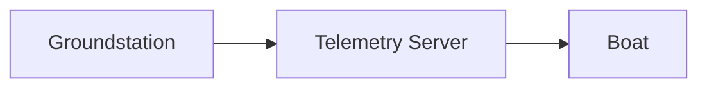

# Writing and editing documentation pages

Every page in `docs/` is a Markdown file rendered by MkDocs Material. Follow these rules so pages render correctly and stay consistent with the rest of the site.

## Required YAML frontmatter

Every `.md` page **must** start with a YAML block containing `title` and `description`:

```markdown
---
title: Add Documentation
description: Add a new documentation page.
---

# Add Documentation
```

- `title` — the page title shown in the nav and at the top of the page.
- `description` — one sentence, shown in search results and nav previews. Make it descriptive, not generic.

A page without frontmatter will still render, but it will have no title in the nav and won't surface well in search.

## Filenames

- Use `snake_case` with underscores: `adding_documentation.md`, `new_member_info.md`, `diagram_of_ros_nodes.md`.
- No spaces, no hyphens, no CamelCase.
- The filename (minus `.md`) becomes the URL slug, so keep it short and descriptive.

## Heading hierarchy

- Start at `#` (H1) for the page title — there should be exactly one H1 per page.
- Use `##` for major sections, `###` for subsections, etc. Don't skip levels (no `#` → `###`).
- Match the nesting depth of sibling files in the same directory. If you're editing a file that already uses `####` for individual files (like `groundstation_overview.md`), follow that pattern.
- Heading text uses Title Case or sentence case — match the surrounding file.

## Body content

- **Link, don't embed.** If a sibling repo's README or another docs page already explains something, link to it instead of copying.
- **Prefer Markdown over raw HTML.** MkDocs Material supports most common Markdown. Use HTML only when Markdown can't express what you need (e.g. `<p style="text-align: center;">`).
- **Code blocks should specify a language** (```sh, ```python, ```json, ```yaml) so syntax highlighting works if it's re-enabled.

## MkDocs Material extensions enabled

See `mkdocs.yml` `markdown_extensions` for the full list. The ones you'll use most:

### Admonitions

Use these instead of bold "NOTE:" text in paragraphs:

```markdown
!!! note "Optional title"
    This is a note. Indent the body by 4 spaces.

!!! warning
    This is a warning with the default title.

!!! note "mac OS Users"
    We can use brew for this.

    ```sh
    brew install mkdocs-material
    ```
```

Supported types include `note`, `warning`, `tip`, `danger`, `info`. See the [MkDocs Material admonition docs](https://squidfunk.github.io/mkdocs-material/reference/admonitions/).

### SuperFences

Supports nested code blocks inside admonitions (as shown above) and Mermaid diagrams:



### Math (MathJax)

Inline: $E = mc^2$. Block:

$$
\frac{d}{dt}\vec{p} = \vec{F}
$$

### Keys, critic, caret, mark, tilde

- `pymdownx.keys` — render keyboard keys: `++ctrl+c++`
- `pymdownx.critic` — track-changes markup: `This is {--old--}{++new++} text.`
- `pymdownx.caret` / `pymdownx.mark` / `pymdownx.tilde` — superscript, highlight, subscript

## After editing

Run `mkdocs serve` to preview at <http://127.0.0.1:8000>. The page should appear in the nav and render without warnings in the terminal output. If a page doesn't appear in the nav, you forgot to add it to `mkdocs.yml` (see the `mkdocs-nav.instructions.md` file).
