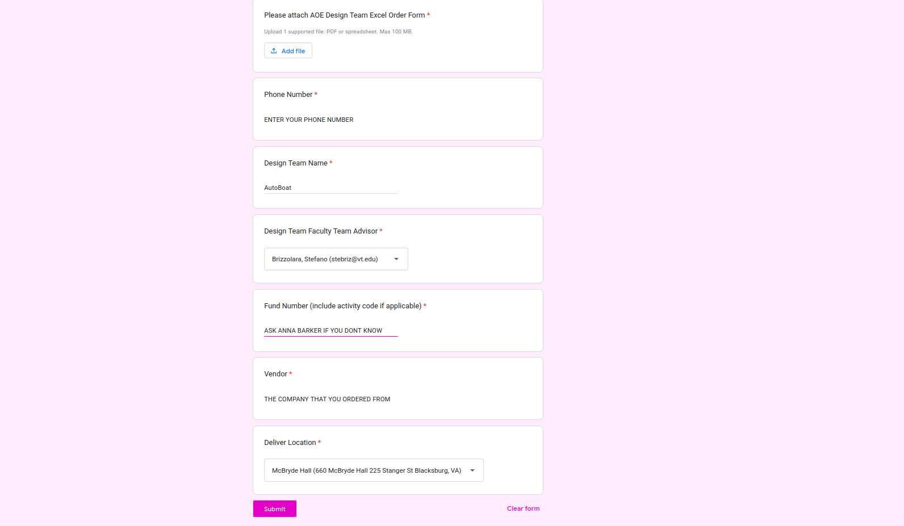

# AOE Funding Documentation

## Engineering Fee Fund

We get around $5000 dollars every year from the AOE department via their Engineering Fee Fund. This funding source is **not reimbursement based** and instead in order to access it, there is a form you have to access and once you fill it out, the AOE department will order that item for you. These funds may not be used for travel purposes. 

In order to get access to this fund, at the beginning of the year, you need to fill out a whole funding application where you have to put a bunch of line items you would like to get funding for and how much they cost. The AOE department will then use that to estimate how much money you will need for the year and then they will allocate that money to the team. These line items don't matter as much as SEC in the sense where every time you try to access the funds, the AOE department doesn't go and check what is in the line items and if what you just asked for funding for was actually in the line items. The line items are more so there just to estimate how much money you will need as a team.

There are a list of preferred vendors/ suppliers that they would rather you buy from, but this is not an "end all be all" situation. I have bought sketchy and expensive motors from a small company in China before with AOE funds, so as long as there isn't an equivalent in their list of preferred vendors/ suppliers list, then you are all good. The list of AOE preferred vendors are Lowes, Amazon, Grainger, McMastercarr, and Digikey. As I understand it, something like Mouser is equally as acceptable, but the general rule of thumb is to not to try to buy stuff from some shady vendor when you don't need to, since it makes the AOE department's life easier.

In order to actually buy something with the AOE fund, you need to fill out the AOE funding form. Below is a version of the AOE funding form from the Spring of 2026 that we will use as a reference, so you generally know how to fill these things out:

The main things that should really never change are the Design Team Name which is "AutoBoat", the Design Team Faculty Advisor (Stefano Brizzolara), and the Delivery Location which should be **McBryde Room 660**. You can technically get stuff delivered to other locations, but McBryde is by far the closest to the Ware Lab. The other two that are a bit trickier are the fund number/ activity code and the AOE Design Team Excel Spreadsheet. 

- The fund number/ activity code is generally given out by the Administrative Support Specialist (who is currently Anna Barker at [annab12@vt.edu](mailto:annab12@vt.edu)). You would also be able to find it by digging through old messages on the [autoboat@vt.edu](mailto:autoboat@vt.edu) email or by emailing an officer that has already used the AOE fund.

- The AOE Design Team Excel Spreadsheet is the way that you tell them which items you actually want to buy, from where, how many, what price, etc etc. To fill this out, go to the google drive and find the "Finance" folder. Under that, there should be a folder called "AOE_Funding_Forms", which houses all of our past AOE funding forms. Here, you can click through them and see the required format; also, take note that the funding forms are split by both date and which vendor they are ordered from. The AOE department specifically wants us to split the form by vendor, so make sure that you submit a separate form for Amazon vs Lowes or McMasterCarr vs Mouser. From the "AOE_Funding_Forms" folder, you can simply copy one of the spreadsheets and work off of that to build the spreadsheet detailing what you want to buy.

If you have any questions about any of this, please email the Administrative Support Specialist for the AOE department. The current one can be found below:

- Name: Anna Barker
- Email: [annab12@vt.edu](mailto:annab12@vt.edu)

## Foundation Account

We also manage our foundation account fund that we currently have a large sum of money in. You are NOT to access this on a regular basis. This fund is essentially meant to act as insurance so that if there are any emergencies or large sums of money the team needs to pay out (ie damaging the ware lab truck/ trailer) only then are we to use this fund for that. In order to access this fund, you just have to email the Administrative Support Specialist for the AOE department, which is given in the previous section, and they will walk you through how to use it.
