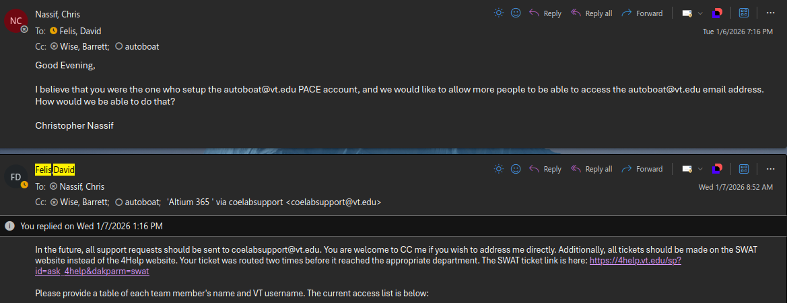

# Getting Access to the AutoBoat Team Email Address

If you would like to get access to the autoboat team email, you need to email the IT support supervisor. The Virginia Tech email is a type of PACE account. The documentation of how PACE accounts work is kind of bad, but if you want it, it can be found in the following link: https://4help.vt.edu/sp?id=kb_article&sysparm_article=KB0011213&sys_kb_id=0131a8211b7c3650d2e46201604bcbd1&spa=1.

This email is our primary official means of communication with the team. If we need to correspond with the ware lab manager, the head organizer of the PEP competition, make recruitement emails, etc they should all be done through this email.

Once you have access you can access the email simply by visiting the following url: https://outlook.cloud.microsoft/mail/autoboat@vt.edu/

The person you need to contact in order to get access to the autoboat team email can be found below:

- Name: David Felis

- Email: dalvarez@vt.edu

