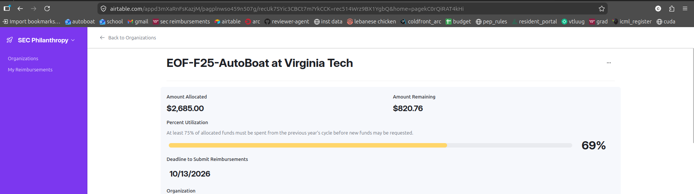
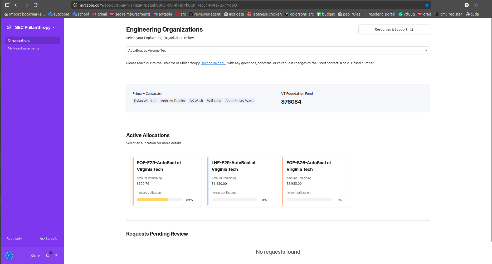
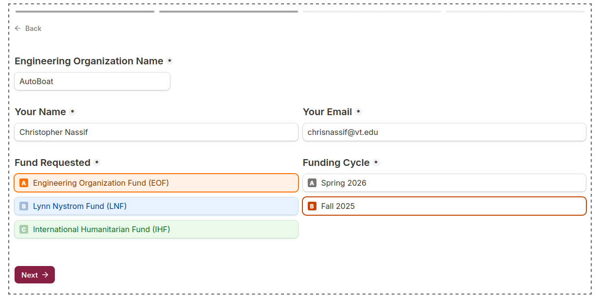
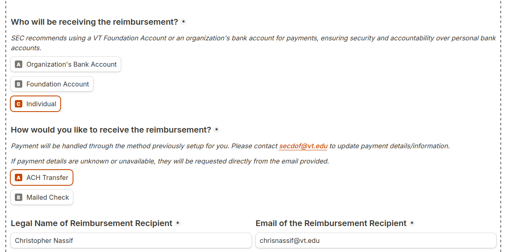
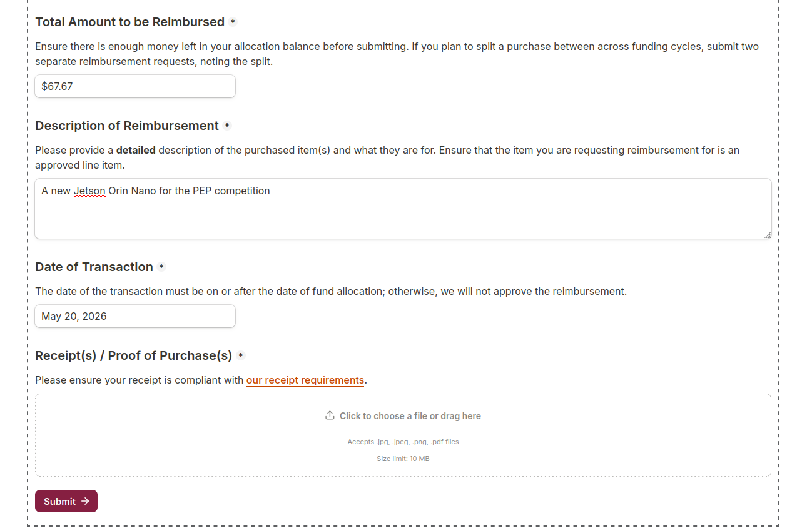

# SEC Funding Documentation

## Overview of SEC Funding

SEC is a **reimbursement** based funding source that generally gives us around 2500-3000 dollars per semester through the EOF fund and 2000 dollars per semester through the LNF fund. The EOF fund mainly covers engineering supplies such as if we would like to buy a new motor, wires, epoxy, resin, jetsons, etc etc and the LNF fund mainly covers travel costs such as the cost for hotels. There is an application at the beginning of each semester for funding that you will need to fill out. You can see an overview of how much money we still have left in this fund through an app called airtable once you get access to it. The money is split both between semesters and also split between different allocations (ie EOF and LNF) and you can see exactly how much money is in each of those allocations. You need to spend over 75% of a specific fund before the deadline to be able to apply for funding next year. The deadline to submit funding is generally about a year after the semester that the fund was allocated for. For example, for SEC EOF Fall-2025, the deadline to submit reimbursements is 10/13/26.

You can generally see the funding deadline for each funding allocation in airtable like so:

 

For additional information, you can always consult this page: <https://www.sec.vt.edu/philanthropy/funds/policies/reimbursement-process.html>

## Applying for the SEC Fund at the Beginning of the Semester

At the beginning of the semester, someone on the team should receive an email about what they need to do in order to get approved for SEC funds. There are a couple of weird requirements that they usually have for people applying to funding. There is a mandatory "general body meeting" sort of thing that you will get emailed by SEC about, which you also have to attend. In the fall semester there will be a certain number of volunteer hours that your team has to fill (usually at an event like Engineering Expo) and in the spring semester, you are usually required to attend a certain number of events in something called E-week. To keep it short, E-week is a week of fun that SEC puts on every year that generally entails things like laser tag, trivia, etc and to get funding in the spring semester from SEC, you just have to complete a certain number of these events. After you fulfill these requirements (and whatever else they explicitly give you) then they will send you a form you need to fill out where you enter all of your line items that you would like to request funding for and they will approve whatever they want out of that.

 

SEC is generally very picky about whether or not the line items that you put on the application are actually what you ended up buying, so make sure that you properly plan ahead! In general, we should be trying to deplete the SEC funds before anything else since these are the most restrictive funds out of all of them. We don't want to be in a situation where all of the line items of SEC were spent on the AOE fund and now we can't find anything that we can spend SEC money on. Remember, if we don't deplete 75% of the funds before the funding deadline we won't be able to apply for SEC funding the next year, so this is very important!

## Getting Access to The Airtable to View Available Funds and Allocations

In order to access the airtable page, which we use to look at how much more funds we have in each semester's SEC allocations, then you should email secdop@vt.edu asking for access to the airtable for the AutoBoat team. There isn't anything especially fancy you need to do, just ask them how to get setup with the airtable and they will walk you through the process.

## Setting up Banking Information For Reimbursements

Before putting in a reimbursement request you also have to get your banking information set up with SEC so they can send you a direct bank transfer for reimbursement. You can get this set up after you put in a reimbursement but it is just more annoying and much more stressful than getting it done before you have already spent money. To do so, please email [secdof@vt.edu](mailto:secdof@vt.edu) to get your direct bank transfer information set up. After you finish getting your information set up, you should be able to just fill out the reimbursement form telling them to send the reimbursement to "Your Legal Name" and "Your VT Email" and it should just work.

## Filling out The SEC Reimbursement Form

First, before filling out the form, make sure you have a receipt from the vendor/ supplier that complies with the following receipt requirements: <https://www.sec.vt.edu/philanthropy/funds/policies/receipts.html>. If the receipt that you submit to SEC does not follow these requirements, then you should make sure to get one from the supplier. If you have multiple receipts that together cover all of the information that SEC requires, then you can stitch those into a single pdf and submit that as your receipt.

To access the SEC Reimbursement Form, please go to the following form: 

- <https://www.sec.vt.edu/philanthropy/funds/reimbursements.html>

Once you finish filling out the form it usually takes anywhere from 1-2 weeks for them to process your reimbursement, accept/ reject the reimbursement, and send you the reimbursement money to your bank account. If your reimbursement ever gets rejected, you can always fix the reason why it got rejected and resubmit the reimbursement.

 
    
The following is basically just a step by step walkthrough of how to fill out the form:

