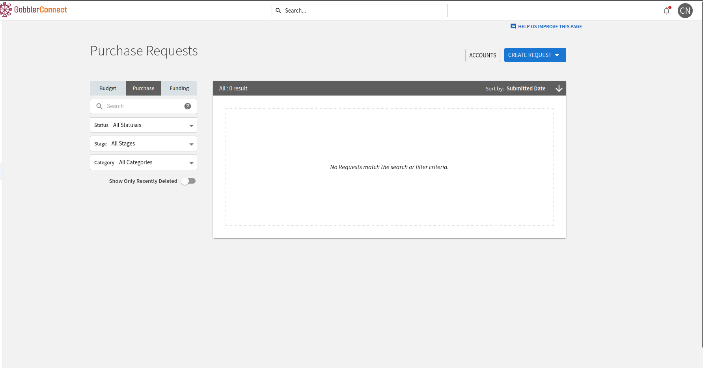
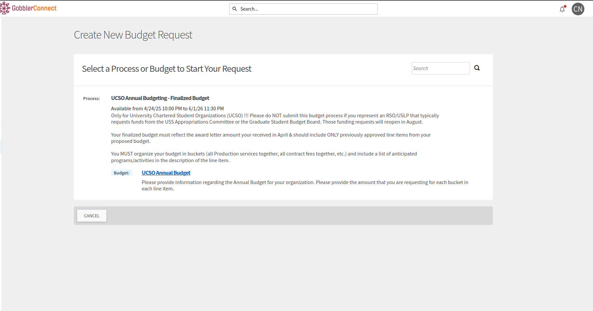

# USS Student Organization Funding

## Overview

This is a **reimbursement** based fund that you do not have to apply to or really do much to access. The main downside is that you have to order things very far ahead of time, so this should mainly be used for travel and items that you know you will need ahead of time, but the fund gives us a very good amount of money, so we should definitely use it!

## Accessing the Funds

You can request funding for a particular item via GobblerConnect by going to the finance page of the GobblerConnect page:

It doesn't show the USS funding here, but whenever the funding opens up in the fall, it will show the normal funding for RSO's (Registered Student Organizations). RSO's are the designation for a particular "type" of student organization and AutoBoat currently is an RSO, although this may change in the near future. The mechanics of RSOs vs USLPs vs the other types of student organizations aren't really important right now. The only important part is knowing that we are an RSO.

You can go to the following link if you would like to learn more about accessing USS funds: https://campuslife.vt.edu/content/campuslife_vt_edu/en/Student_Orgs/orgfunding/_jcr_content/content/download/file.res/Requesting%20Payment%20for%20Approved%20Student%20Organization%20Funding%20Requests.pdf

## Funding Categories, Maximums, and General Rules

These are all subject to change. Please consult the most up to date version of the USS Student Organization Funding at TODO PUT THIS LINK TO THE USS FUNDING DOCUMENTATION HERE

### Funding Types and Maximums:

- Operational Funding (up to $6,000/year) for general events, supplies, equipment, insurance

- Guest speakers/performers under $5,000.

- Collaborations: $5,000 per org.

- Major Event Funding (up to $7,500/year). These are events in major venues (GLC, Squires, etc.) and having 1,000+ attendance, OR contracted guest over $5,000. Must apply 60 days in advance

- Conference/Competition/Service Trips (up to $3,000/year). Max 6 trips/year, 8 students funded per trip. Covers transportation, lodging, registration only (no meals). Must apply 30 days in advance

### Critical Deadlines

- Operational/Conference: 30 days before event

- Major Events: 60 days before event

- Reimbursements: 15 days after event (5 days after receiving invoice)

### What They WON'T Fund

- Food (except cultural tastings up to $1,500/year)

- Gift cards, prizes, promotional items

- Fundraising items, personal financial gain

- T-shirts/apparel for advertising

- Recruitment costs

- Individual membership dues

### Important Funding Caps

- Decorations: 20% of event budget or $300, whichever is lower

- Advertising: 20% of event budget max

- Photography/videography: $300/year (marketing only)

- Awards/trophies: $300/year

- Cultural food tastings: $1,500/year

You can learn more at the following links:
- https://campuslife.vt.edu/content/campuslife_vt_edu/en/Student_Orgs/orgfunding/_jcr_content/content/vtcontainer_260361155/vtcontainer-content/vtmultitab_396657388/vt-items_0/download_copy_copy/file.res/2025-2026%20USS%20Appropriations%20Policy%20and%20Procedure.pdf
- https://campuslife.vt.edu/Student_Orgs/orgfunding.html

If you have any questions, you can always email appropriations@vt.edu or orgfunding@vt.edu
