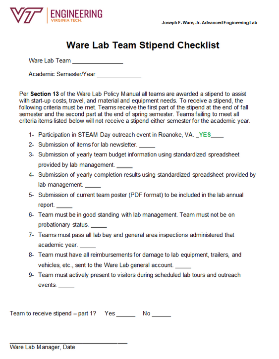

# Ware Lab Stipend Funding

## Overview

This is a **non reimbursement based** fund is given per semester by the ware lab and is usually around $1000 in the fall semester and $500 in the spring semester, although these numbers are highly dependent on the year and how much funding the ware lab receives. You can pretty much do whatever you want with the money with little oversight since they just transfer the money to a bank account of your choosing.

For this fund you have to complete a range of things detailed in a checklist that Dewey will send you each semester. If you have any questions about specific items on the checklist, please email the ware labe manager (currently Dewey Spangler at spangler@vt.edu). Below is an example of the checklist for Spring 2026:

If you would like to learn more, you can email the Ware Lab Manager who is currently:

- Name: Dewey Spangler
- Email: spangler@vt.edu.
