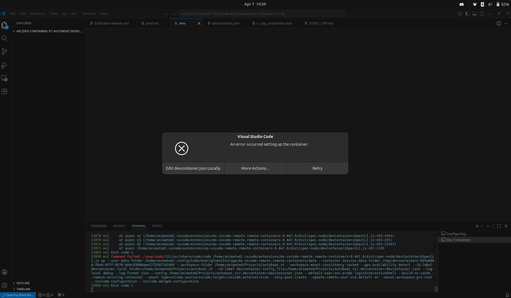
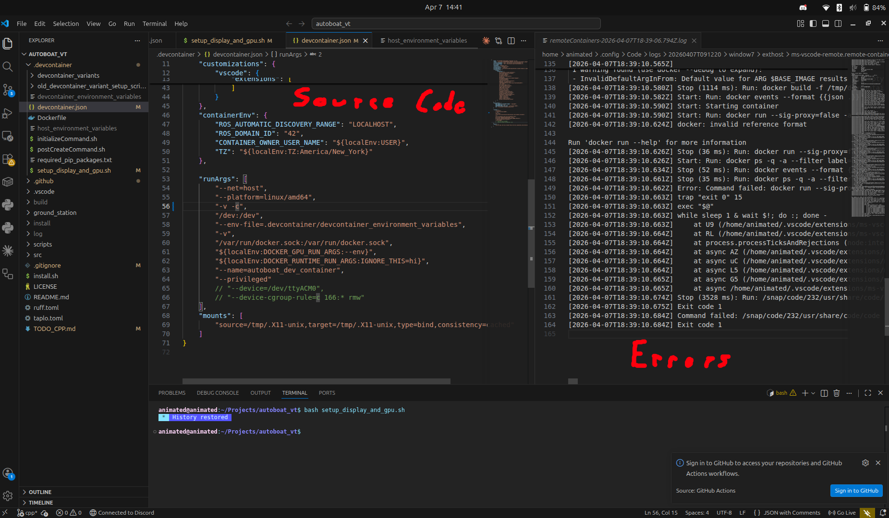
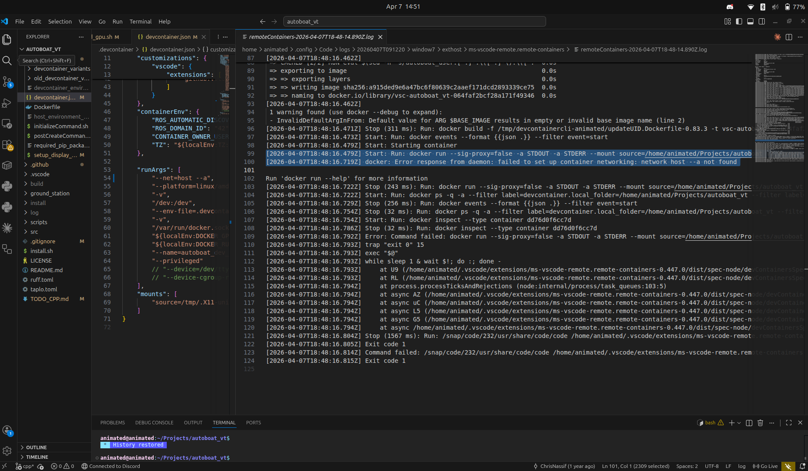

# 
Common Devcontainer Issues and How to Solve Them

This page will detail how to figure out why your devcontainer is having an error and how to solve the common ones that new users run into a lot. 

## 
How to Access Devcontainer Error Messages

Whenever the devcontainer errors out, it should open up a screen like this:

In order to access the error trace, you need to press the "edit devcontainer.json locally" button. If you wait for a little bit, a tab should pop up
to the side; this is where our error trace will be located. See below for an example of what this tab should look like.

If you enlargen this tab and scroll down, you should eventually find the real error (although this might take a bit of time to find, since the real error may try to hide itself!).

Generally the real error message is above the message that says "Run `docker run --help` for more information". In this case, I added an extra `--a` 
in one of the lines where I was specifying my `runArgs` for the container: `--net=host --a`.

## 
 Common Devcontainer Errors

**TODO TODO TODO TODO TODO POPULATE THIS AS PEOPLE HAVE ISSUES**
