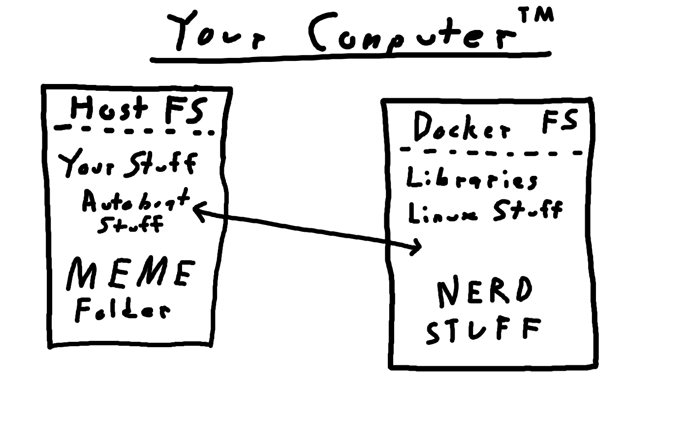
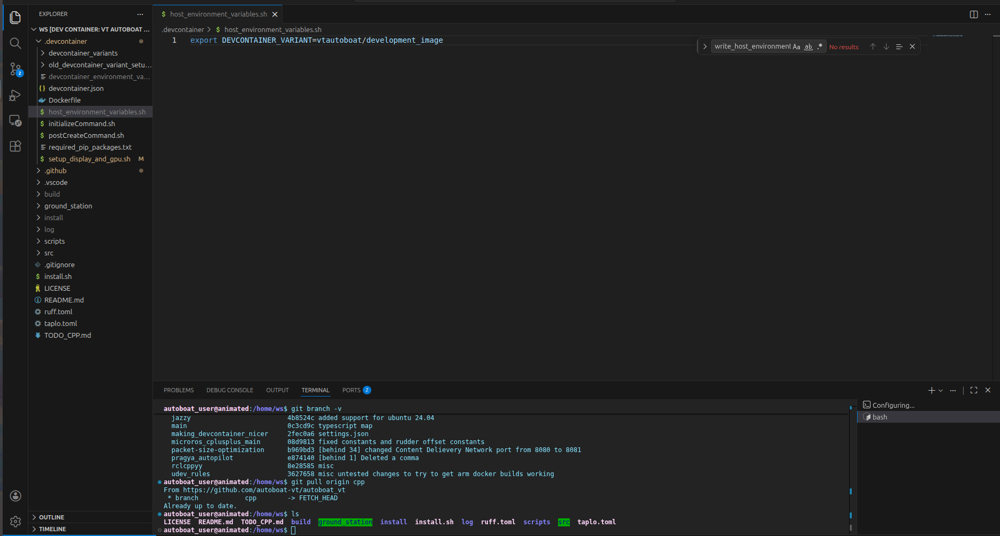
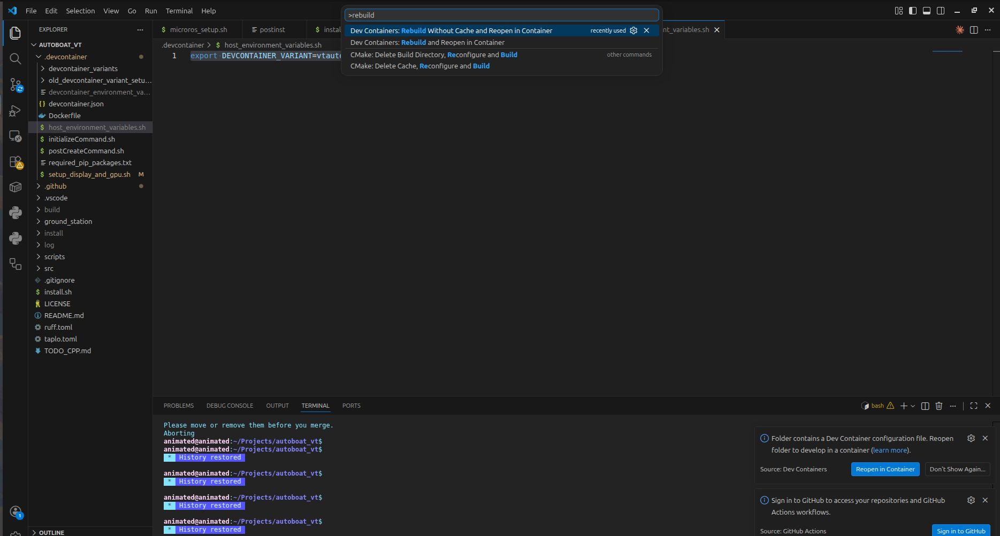

# <p style="text-align: center;">Devcontainer 101</p>

!!!NOTE "Wait what is Docker again?"
    This documentation assumes that you are familiar with what Docker containers/images are and how they work at a basic level. If you are not familiar with Docker, please review the following: 
    [Installing Docker Documentation](../getting_started/installing_docker.md)

## <p style="text-align: center;">Why Do We Need A Devcontainer?</p>

A *devcontainer* is a development environment that is built on top of a Docker container. This has the following advantages:

- It allows us to isolate our software from the rest of the user's computer, which allows us to ensure that if a piece of software works on your computer, it will work on everyone's computer and whatever computer that we are deploying the code onto.
- It allows us to have a standardized development environment that works without needing to worry about the user's operating system, architecture, currently installed packages, etc.
- It allows us to have a standardized set of extensions for VSCode that are automatically installed and configured to work with our codebase.

## <p style="text-align: center;">What Happens to The Files You Changed in the Devcontainer?</p>

Lets say you just implemented an awesome new feature to the Groundstation, but now want to exit the devcontainer for whatever reason. You may worry that the totally dope new code you just wrote will be lost to the man who lives inside the computer.

Fret not my friend! The files inside your devcontainer are actually the *same* files as the ones **outside the devcontainer**. This is possible thanks to *[bind mounting](https://docs.docker.com/engine/storage/bind-mounts)*, a feature of Docker that allows us to expose files from outside the devcontainer which can then be edited from inside the devcontainer. **Any** change you make to the files inside the devcontainer will automatically be reflected on your native operating system's filesystem (for Linux or macOS users) or inside of your WSL filesystem for Windows users. Please see the below figure for a visual representation of this concept:



Thus, you can rest assured that any changes you make to the code inside the devcontainer will be reflected on your computer's filesystem and will not be lost when you exit the devcontainer.

## <p style="text-align: center;">How Are All of the Files in the `.devcontainer` Folder Structured?</p>

### `devcontainer.json`
This is the main file that describes the devcontainer and how it should be built. This file is used by VSCode to know how to build the devcontainer and what docker image to use, what extensions to install, what commands to run on startup, etc.

### `host_setup.sh`
This file is run once by the user on the host computer when initially setting up the devcontainer. It ensures that you have the proper packages installed and environment variables set on your computer in order to allow the devcontainer to access your display and GPU for the Groundstation and computer vision. This file also does other miscellaneous things such as installing proper udev rules for all of the connected devices that we support.

### `initializeCommand.sh`  
This command is run on the host computer before the Docker container starts up. This is primarily used to ensure that whenever you rebuild the devcontainer, that you have the most up to date version of the Docker image for the devcontainer. Please note that the VSCode implementation of the `initializeCommand` is actually bugged and is different from what the devcontainer standard actually requires; please see the following link for a more thorough explanation: <https://github.com/microsoft/vscode-remote-release/issues/9278>. 

### `postCreateCommand.sh`
This file is run before the `.bashrc` file run and is where we setup any librariers or packages that need to be installed inside the devcontainer after the docker image is built. This is also where we can put any commands that we want to run every time we start up the devcontainer such as sourcing the ROS2 workspace or setting up environment variables. It is in a way similar to the `.bashrc` file, but it is only run once when the devcontainer is first created and not every time a new terminal is opened inside the devcontainer.

### `host_environment_variables`
This is a file generated by `host_setup.sh` that contains environment variables that are used by `devcontainer.json`. An example of the contents of this file can be seen below:
```bash
# Host environment variables for autoboat-vt
export DEVCONTAINER_VARIANT=vtautoboat/development_image
export docker.for.mac.host.internal:0
```
It also adds code to your shell's startup file (e.g. .bashrc) to ensure that these environment variables are automatically loaded into your environment every time you open a new terminal.

### `devcontainer_environment_variables`
This file is generated by `host_setup.sh` and is used by `devcontainer.json`. All of the environment variables specified in this file are automatically imported into the `--env-file` argument for running Docker containers as seen here: <https://stackoverflow.com/questions/68122419/how-do-i-create-a-env-file-in-docker>. This file can be used for setting the username visible to the Groundstation and setting the display that the Groundstation should render to. An example of the contents of this file can be seen below:
```bash
devcontainer_environment_variables

DISPLAY=:0
USER=animated
```

### `Dockerfile`:
  This is the Dockerfile that describes the Docker image that the `devcontainer.json` uses. **PLEASE NOTE** if you edit the Dockerfile and rebuild the devcontainer, nothing will happen because the Docker image that the devcontainer uses is pulled directly from Docker hub (<https://hub.docker.com/u/vtautoboat>), which is the place where the CI/CD pipeline stores the Docker images that we create after you push to main or create a new version tag. The issue is that in order to get your custom Docker image to show up in Docker hub, you would need to first push to main, which defeats the purpose of testing before you push to main. The resolution to this issue is discussed thoroughly in the next [section](#how-to-test-custom-docker-images) of this document.

### `required_pip_packages.txt`
  This lists all of the Python package requirements that the Python ROS2 packages and the Groundstation require to run properly. The python packages listed in here are automatically installed via the Dockerfile. This is similar to a `requirements.txt` file if you have ever worked on other Python projects, but it is renamed for clarity.

## <p style="text-align: center;">What Are Devcontainer Variants?</p>

We need to have different variants of the devcontainer because some parts of the codebase may require fairly large dependencies that are only useful for that part of the codebase. However, many require the same dependencies, so it would be a waste of disk space to have a different devcontainer for every single subsystem in the codebase. Thus, we have only a few different devcontainer variants that we use for different parts of the codebase depending on the dependencies that they require. For instance, if you are working on the firmware, then you would want to use the `vtautoboat/development_image_firmware` devcontainer variant because it has all of the firmware dependencies already installed and set up. However, if you are not working on the firmware, then you can just use the `vtautoboat/development_image` devcontainer variant which does not have firmware dependencies installed and thus takes up much less disk space.

The following are the currently available devcontainer variants:

- `vtautoboat/development_image`
- `vtautoboat/development_image_firmware`
- `vtautoboat/development_image_deepstream`

## <p style="text-align: center;">How to Change the Devcontainer Variant You Are Currently Using</p>

In order to switch the devcontainer variant you are currently working with, you have to perform the following steps:

1. Go to the `.devcontainer/host_environment_variables.sh` file that should be automatically created from `host_setup.sh`.


2. Then edit the line that says `export DEVCONTAINER_VARIANT=vtautoboat/development_image` so that the `DEVCONTAINER_VARIANT` environment variable contains the name of the devcontainer you want to use. For instance, if you want to use the microROS devcontainer, then you should edit the line to be `export DEVCONTAINER_VARIANT=vtautoboat/development_image_firmware`. 

3. Once you have changed this line and saved the file, then close VSCode and then go to a WSL terminal or normal Linux/macOS terminal thats open at the root of the autoboat_vt repository and then run the following command:
```bash
source ~/.bashrc && code .
```
This will refresh your `.bashrc` and open VSCode on your autoboat_vt repository. 

4. Once VSCode opens, please run "Rebuild without Cache and Reopen Container" to rebuild the devcontainer so that it now uses the new devcontainer variant of your choice.

Now you should be running the devcontainer variant of your choice and you should have everything preinstalled.

## <p style="text-align: center;"> How to Test Custom Docker Images</p>

If you would like to create and test your own Docker images for your individual branch, then you need to build the image so that you have it locally using Docker build, push the image to Docker hub, and use your custom Docker image as a "devcontainer_variant".

1. The command below will build your custom Docker image. Make sure to run this in the root of the repository and edit the `temp_tag` part with whatever your branch's name is. For example for a branch called `motorboat_simulation`, you would replace `temp_tag` with `motorboat_simulation`. Keep note of what this tag is as we will need it in future commands.
```bash
docker build -t vtautoboat/development_image:temp_tag -f .devcontainer/Dockerfile .
```

2. Next, go to your browser and open Docker hub. Log into Docker hub using the autoboat Docker hub account. If you do not have the credentials for the autoboat Docker hub account, please ask an officer and they should be able to help you. Once you have logged in on your browser, run the following command and follow the given instructions to log into Docker hub in your terminal:
```bash
docker login
```

3. Once you have been successfully logged in, run the following command to push your custom image to Docker hub. Remember to replace `temp_tag` with the name of the branch you are working on.
```bash
docker push vtautoboat/development_image:temp_tag
```

4. Now, your custom docker image should show up as a devcontainer variant! You should now be able to edit `.devcontainer/host_environment_variables` to point to this new devcontainer variant. After editing `.devcontainer/host_environment_variables`, you just have to close VSCode, run `source ~/.bashrc && code .`, and then rebuild the devcontainer to open a devcontainer based on your custom Docker image. When you are ready to pull request to main, your custom Docker image will automatically be used as the default devcontainer that will be installed on everybody's computer. This process is handled automatically via the CI/CD pipeline by building the default devcontainer off of whatever Dockerfile is found in the main branch of the repository.

## <p style="text-align: center;"> How Does the Devcontainer Interact with the CI/CD Pipeline?</p>

When a commmit is pushed to main or a new version is created and pushed to the Github repository, the CI/CD pipeline will automatically build the `vtautoboat/development_image` and `vtautoboat/development_image_firmware` Docker images and push them to Docker hub. There is a trigger on Docker hub to update the `vtautoboat/development_image_deepstream` automatically whenever the `vtautoboat/development_image` is updated. This is not built on the Github action because unfortunately it requires more disk space to build than Github actions is willing to give us for free.
