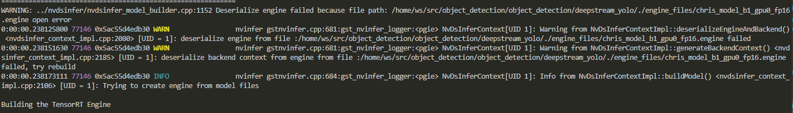

# <p style="text-align: center"> Before Installing DeepStream </p>

Make sure that you have set up the dev container prior to attempting install.

!!!NOTE "General"
    In order to run inference, an NVIDIA 30x series GPU or newer is required.
    
    This will not work on macOS and ARM systems.

## <p style="text-align: center"> Installing DeepStream </p>

Inside the dev container, make sure your current working directory is `/home/ws/`.

Execute this script to start the installation.

```sh
bash .devcontainer/old_devcontainer_variant_setup_scripts/install_deepstream_yolo_dev_container.sh
```

This installation can take a long time.

## <p style="text-align: center"> Connecting the Camera </p>

!!!NOTE "Running without camera"
    If you do not want to run with the camera, or do not have it, run
    ```sh
    export CAMERA=false
    ```

In order to run the object detection module, the Intel RealSense D457 camera must be connected and forwarded to WSL

To forward the camera device to WSL, follow [these instructions](../examples/connecting_a_usb_device_to_wsl.md)

!!!Note "Making sure the camera is seen in WSL"
    To verify the connection, run this command in the dev container
    
    ```sh
    v4l2-ctl --list-devices
    ```

    A properly connected camera will have an output similar to this (the numbers may be different)

    ```sh
    autoboat_user@docker-desktop:/home/ws$ v4l2-ctl --list-devices
    Intel(R) RealSense(TM) Depth Ca (usb-0000:00:14.0-1):
            /dev/video0
            /dev/video1
            /dev/video2
            /dev/video3
            /dev/video4
            /dev/video5
            /dev/media1
            /dev/media2
    ```

## <p style="text-align: center"> Building an Engine File </p>

!!!NOTE "Running without inference"
    If you want to disable inference and skip the model creation, run
    ```sh
    export INFERENCE=false
    ```

To build an engine file, navigate to the deepstream_yolo directory. This can be done without a camera connected.

```sh
cd /home/ws/src/object_detection/object_detection/deepstream_yolo/
```

You need to know whether this model is Yolo26 or Yolo11.

Place the .pt model file in this directory.

Run the following script to build a .engine model file based on the .pt file. This will take a while. Fill in `<name_of_pt_file>` without the file extension. For example, if your model is named `yolo26s.pt`, you should enter `yolo26s`.

For Yolo26
```sh
# Build an engine file
bash build_engine_file26.sh <name_of_pt_file>

# For example with model file named yolo26s.pt
bash build_engine_file26.sh yolo26s
```

For Yolo11
```sh
# Build an engine file
export YOLO_VER=11
bash build_engine_file11.sh <name_of_pt_file>

# For example with model file named yolo11s.pt
export YOLO_VER=11
bash build_engine_file11.sh yolo11s
```

You will see a couple warnings similar to shown below. Those are normal.



After running the script, the file will be moved to the `pt_files/` directory. The script will look for files in both the `deepstream_yolo/` directory and `pt_files/` directory, if it exists.

## <p style="text-align: center"> Running the Object Detection Module </p>

After a model file has been created, you can run the ROS2 object detection module.

```sh
ros2 run object_detection object_detection
```

If you disabled the camera, the video feed will be static.

For more information and dynamically changing parameters, see the [Object Detection Node](../ros2_packages/object_detection_package/object_detection.md).