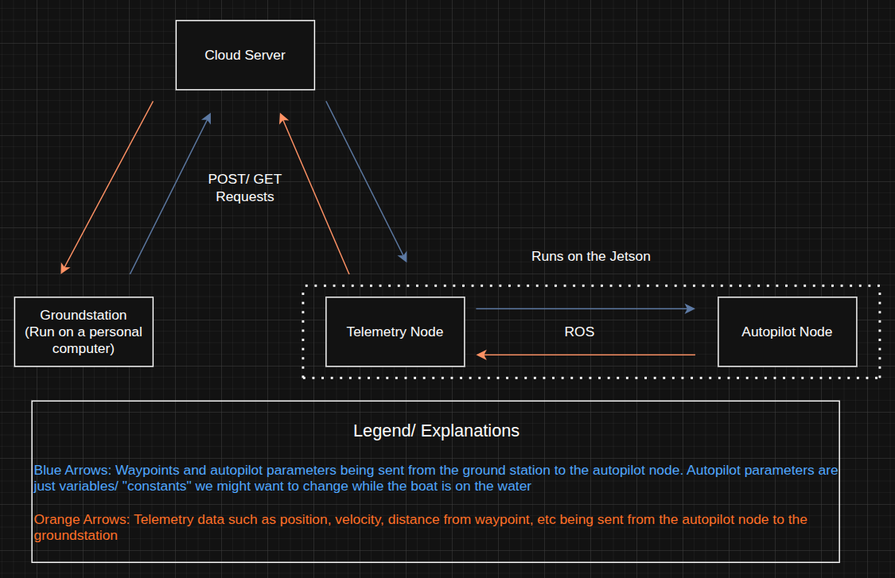

## Introduction

This document provides an overview of the Telemetry Server API routes, detailing the available endpoints, their functionalities, and how they facilitate communication between the telemetry node and the groundstation. The Telemetry Server API is a critical component of the overall architecture, enabling efficient data exchange and management of boat operations. The server lives in its own repository at [`autoboat-vt/telemetry_server`](https://github.com/autoboat-vt/telemetry_server).

**Diagram showing how each component interacts with each other**

## API Routes Overview

The Telemetry Server API is implemented using Python's [Flask](https://flask.palletsprojects.com/en/stable) framework with [Flask-SQLAlchemy](https://flask-sqlalchemy.palletsprojects.com/en/stable) as the ORM. The production stack runs as a Docker Compose cluster fronted by a Cloudflare Tunnel.

Production URL: `https://vt-autoboat-telemetry.uk`  
Testing URL: `https://test.vt-autoboat-telemetry.uk`

The testing instance runs on port `6001` inside the container and the production instance runs on port `8000`; both are Gunicorn apps. The Cloudflare tunnel routes the public hostnames to the right container, so no inbound ports need to be open on the host. The `cron` sidecar calls `/instance_manager/clean_instances` every 5 minutes to evict stale instances.

### Deployment at a glance

| Service          | Purpose                                                          |
| ---------------- | ---------------------------------------------------------------- |
| `telemetry-prod` | Gunicorn app on `:8000` (production)                             |
| `telemetry-test` | Gunicorn app on `:6001` (testing)                                |
| `cloudflared`    | Outbound tunnel to Cloudflare; routes hostnames to containers   |
| `cron`           | Calls `/instance_manager/clean_instances` every 5 min            |
| `tailscale`      | Optional (`--profile tailscale`). SSH access from your tailnet. |

Multi-arch images (`linux/amd64` + `linux/arm64`) are published on every push to `main` to both GHCR (`ghcr.io/autoboat-vt/telemetry_server:latest`) and Docker Hub (`docker.io/vtautoboat/telemetry_server:latest`). See the [telemetry_server README](https://github.com/autoboat-vt/telemetry_server#readme) for full deploy instructions. For local development without Docker: `pip install -e .` then `flask run` (or `gunicorn "autoboat_telemetry_server:create_app()"`).

## Routes

### Autopilot Routes

| Method   | Endpoint                                                                      | Description                                                               |
| -------- | ----------------------------------------------------------------------------- | ------------------------------------------------------------------------- |
| `GET`    | `/autopilot_parameters/test`                                                  | Test route for autopilot parameters.                                      |
| `GET`    | `/autopilot_parameters/get/<int:instance_id>`                                 | Get the current autopilot parameters for a specific instance.             |
| `GET`    | `/autopilot_parameters/get_new/<int:instance_id>`                             | Get the latest autopilot parameters if they haven't been retrieved yet.   |
| `GET`    | `/autopilot_parameters/get_default/<int:instance_id>`                         | Get the default autopilot parameters.                                     |
| `GET`    | `/autopilot_parameters/get_hash/<int:instance_id>`                            | Get the hash of the current autopilot parameters for a specific instance. |
| `GET`    | `/autopilot_parameters/get_config/<config_hash>`                              | Get the autopilot configuration for a specific configuration hash.        |
| `GET`    | `/autopilot_parameters/get_hash_description/<config_hash>`                    | Get the description for a specific configuration hash.                    |
| `GET`    | `/autopilot_parameters/get_all_hashes`                                        | Get all stored autopilot configuration hashes.                            |
| `GET`    | `/autopilot_parameters/get_hash_exists/<config_hash>`                         | Check if a specific configuration hash exists.                            |
| `POST`   | `/autopilot_parameters/set/<int:instance_id>`                                 | Set the autopilot parameters using the request data.                      |
| `POST`   | `/autopilot_parameters/update_existing_parameter/<int:instance_id>/<parameter_key>` | Update a single existing autopilot parameter by key.                      |
| `POST`   | `/autopilot_parameters/set_default/<int:instance_id>`                         | Set the default autopilot parameters using the request data.              |
| `POST`   | `/autopilot_parameters/set_hash_description/<config_hash>/<description>`      | Set the description for a specific configuration hash.                    |
| `POST`   | `/autopilot_parameters/set_default_from_hash/<int:instance_id>/<config_hash>` | Set the default autopilot parameters using a stored configuration hash.   |
| `POST`   | `/autopilot_parameters/create_config`                                         | Create a new autopilot configuration from the request data.               |
| `DELETE` | `/autopilot_parameters/delete_config/<config_hash>`                           | Delete a stored autopilot configuration hash.                             |

### Boat Status Routes

| Method | Endpoint                                     | Description                                                                          |
| ------ | -------------------------------------------- | ------------------------------------------------------------------------------------ |
| `GET`  | `/boat_status/test`                          | Test route for boat status.                                                          |
| `GET`  | `/boat_status/get/<int:instance_id>`         | Get the current boat status for a specific instance.                                 |
| `GET`  | `/boat_status/get_new/<int:instance_id>`     | Get the latest boat status if it hasn't been retrieved yet.                          |
| `POST` | `/boat_status/set/<int:instance_id>`         | Set the boat status using the request data.                                          |
| `POST` | `/boat_status/set_fast/<int:instance_id>`    | Set the boat status using a list of values corresponding to the boat status mapping. |
| `POST` | `/boat_status/set_mapping/<int:instance_id>` | Set the boat status mapping for an instance.                                         |

### Waypoint Routes

| Method | Endpoint                               | Description                                                  |
| ------ | -------------------------------------- | ------------------------------------------------------------ |
| `GET`  | `/waypoints/test`                      | Test route for waypoints.                                    |
| `GET`  | `/waypoints/get/<int:instance_id>`     | Get the current waypoints for a specific instance.           |
| `GET`  | `/waypoints/get_new/<int:instance_id>` | Get the latest waypoints if they haven't been retrieved yet. |
| `POST` | `/waypoints/set/<int:instance_id>`     | Set the waypoints using the request data.                    |

### Instance Manager Routes

| Method   | Endpoint                                                       | Description                                                   |
| -------- | -------------------------------------------------------------- | ------------------------------------------------------------- |
| `GET`    | `/instance_manager/test`                                       | Test route for instance management.                           |
| `GET`    | `/instance_manager/create`                                     | Create a new telemetry instance.                              |
| `GET`    | `/instance_manager/get_user/<int:instance_id>`                 | Get the user of a telemetry instance.                         |
| `GET`    | `/instance_manager/get_name/<int:instance_id>`                 | Get the name of a telemetry instance.                         |
| `GET`    | `/instance_manager/get_id/<instance_name>`                     | Get the ID of a telemetry instance by its name.               |
| `GET`    | `/instance_manager/get_instance_info/<int:instance_id>`        | Get detailed information about a specific telemetry instance. |
| `GET`    | `/instance_manager/get_all_instance_info`                      | Get detailed information about all telemetry instances.       |
| `GET`    | `/instance_manager/get_ids`                                    | Return all telemetry instance IDs.                            |
| `GET`    | `/instance_manager/get_diagnostic_message/<int:instance_id>`   | Get the diagnostic message for a telemetry instance.          |
| `POST`   | `/instance_manager/set_name/<int:instance_id>/<instance_name>` | Set the name of a telemetry instance.                         |
| `POST`   | `/instance_manager/set_user/<int:instance_id>/<user_name>`     | Set the user for a telemetry instance.                        |
| `POST`   | `/instance_manager/set_diagnostic_message/<int:instance_id>`   | Set the diagnostic message for a telemetry instance.          |
| `DELETE` | `/instance_manager/delete/<int:instance_id>`                   | Delete a telemetry instance by its ID.                        |
| `DELETE` | `/instance_manager/delete_all`                                 | Delete all telemetry instances.                               |
| `DELETE` | `/instance_manager/clean_instances`                            | Remove all telemetry instances not marked for keeping.        |

## Wire Format Notes

These are cross-repo invariants. If you change one side (firmware, ground station, server, or website) you must coordinate the change with all the others.

### Request body parsing - the `json.loads(request.json)` gotcha

The boat's telemetry node sends JSON bodies as **JSON-encoded strings** (double-encoded: the request body is a JSON string whose content is itself JSON). The server's `json.loads(request.json)` decode depends on this. Do not "simplify" the node to send a plain JSON body, or every `POST` route will break.

### `boat_status` fast-update binary payload

`POST /boat_status/set_fast/<int:instance_id>` takes a raw binary body, not JSON. The bytes are deserialized positionally against the instance's `boat_status_mapping` using `ctypes.LittleEndianStructure.from_buffer_copy`. This means:

- You **must** call `POST /boat_status/set_mapping/<int:instance_id>` first to define the field order and ctypes types (e.g. `[["speed", "c_float"], ["heading", "c_float"], ...]`).
- The binary payload's field order **must exactly match** the mapping order. `from_buffer_copy` is positional - if you add or reorder a field in the mapping on the firmware side, fast updates will silently decode to garbage on the server.
- Coordinate any field-order change with the firmware, the server's `set_mapping` route, the ground station's display, and the website.

### Diagnostic messages

`POST /instance_manager/set_diagnostic_message/<int:instance_id>` takes a JSON body of `[intensity, message]`, where `intensity` is a `DiagnosticMessageIntensity` enum value:

| Intensity | Meaning |
| --------- | ------- |
| `1`       | INFO    |
| `2`       | WARNING |
| `3`       | ERROR   |

This enum is defined on the server and consumed by both the ground station and the website. If the server changes the int mapping, both consumers must follow.

### Read/write lock manager

All routes (except `/test`) are wrapped by `@shared_lock_manager.require_read_lock` or `@require_write_lock` decorators from `lock_manager.py`. The `get_new/*` routes take a write lock because they flip a "new flag" as a side effect. You don't need to do anything special to call the routes, but be aware that concurrent writers are serialized.
