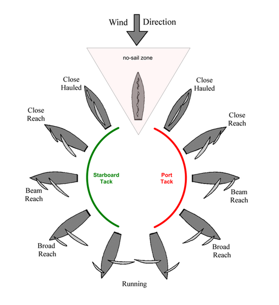
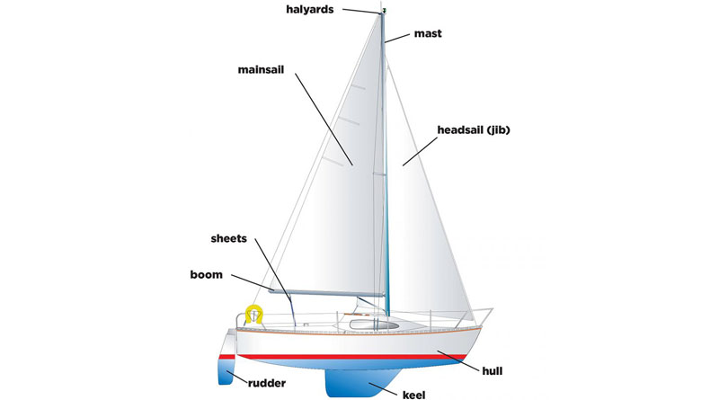
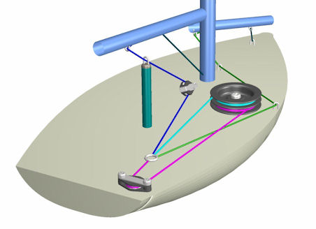
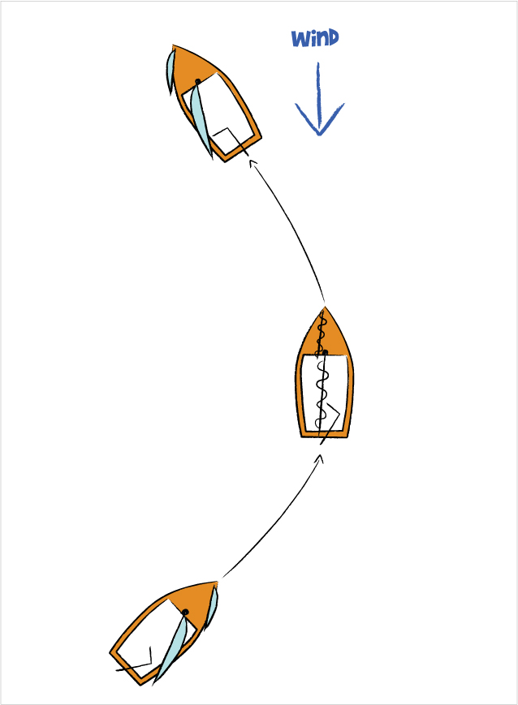
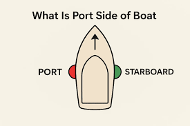
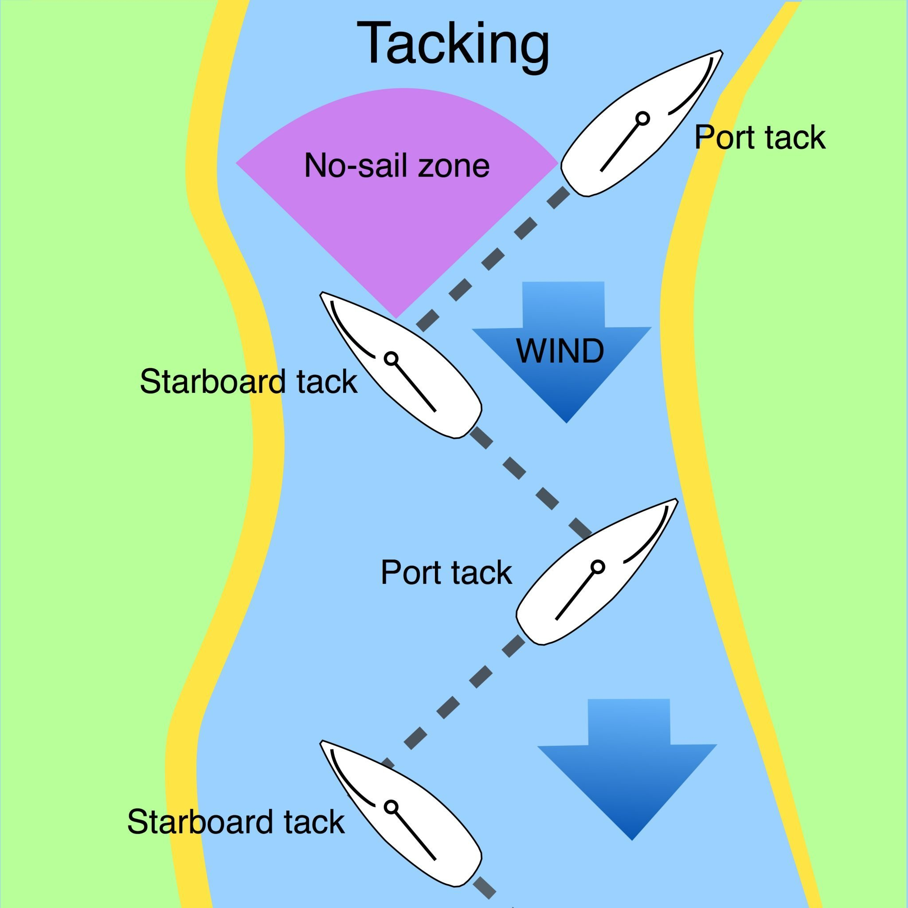
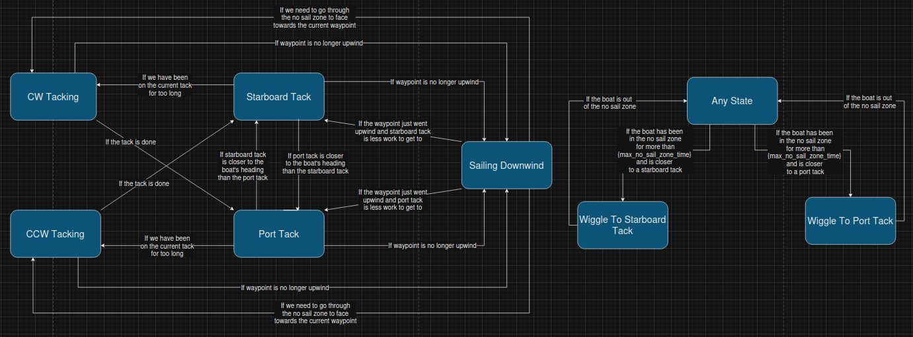

# 
 Sailboat Autopilot 

## The Vocabulary of Sailing

Some vocabulary before we go into more detail about how to sail:

- **No Sail Zone**: A set of angle directly upwind where the boat will never be able to make any forward progress. If the boat is pointing in the no sail zone for too long it may become hard to control/ turn and the boat may become stalled.

- **Point of Sail**: This describes the angle that the boat is sailing with respect to the wind. This is very important since it is the main thing that determines where your desired sail angle and desired heading should be. Each of these has their own speeds associated with each point of sail, and while you don't have to know which ones are faster than others, it is nice to know that they aren't all going to be sailing at the same speed.

- **Mast**: This is the giant cylindrical pole that sticks vertically out of the top of the boat that supports the sail.

- **Boom**: This is a giant cylindrical pole that is attached horizontally in the middle of the mast, which we use a motor to pull on to change the angle of the sail.

- **Winch**: This is a mechanical device that we turn to pull in or let out the boom which in turn moves the sail (the boom is always attached to the sail). This is the primary way that we control the sail on our boats. Below is a diagram that shows how the winch may be attached to the sail. You don't have to know exactly how it is attached. All you have to know is that we can't turn the boom directly to position the sail, we have to instead pull on the boom using a rope.

- **Tack**: This can be used as both a noun and a verb. As a verb this refers to the action to turning across the wind vector as the boat is going upwind. As a noun, this refers to holding a point of sail upwind where you are making progress upwind by sailing just outside of the no sail zone (perhaps by being in a close hauled or close reach point of sail). 

- **Starboard**: A synonym for "right". People will oftentimes refer to the starboard side of the boat which means the right side of the boat. They may also refer to a "starboard tack" which just means a tack where the no sail zone is to the right of your boat.

- **Port**: A synonym for "left". People will oftentimes refer to the port side of the boat which means the left side of the boat. They may also refer to a "port tack" which just means a tack where the no sail zone is to the left of your boat. How I remember the difference between starboard and port is that port has 4 letters and so does left. 

The following aren't as important for our discussion of the autopilot but may still be important if you want to understand what other people are talking about:

- **Keel**: This is a big pole that extends far below the boat to lower its center of mass and increase stability.

- **Bow**: A synonym for "the front of the boat".

- **Stern**: A synonym for "the back of the boat"

- **Jibe**: A similar maneuver to a tack but instead of crossing the wind as it is trying to push you backwards, you are crossing the wind as it pushes you forward (aka you are crossing the wind vector from the opposite direction). This also has the weird quirk of both being used to describe the maneuver of crossing the wind and holding a position that is to an angle to the wind.

## Choosing the Best Sail Angle

As it turns out, for any apparent wind angle, there is generally an optimal sail angle that you should turn the sail to which are generally detailed in point of sail diagrams as shown in the vocabulary page. As long as the sail angle follows the pattern in the diagram for the sail angle, then the boat will be moving the fastest in that direction. To accomplish this, we use a lookup table that linearly interpolates between the optimal sail angles given in the sail lookup table (which is described in the autopilot parameters):

The code works by taking the two closest wind angles and their corresponding closest sail angles, then we construct a line out of that and figure out where we fall along that line. This is called linear interpolation. 

## How Do We Sail Upwind?

You may be wondering, how is the boat able to sail slightly upwind in the sailing diagram? Well, this is a neat quirk of sailing that is the entire reason why sailing is even possible in the first place. If we are able to hold an angle right outside of this "no sail zone", then we are able to gain some ground going upwind, and if we can go in a zig zag motion upwind, then we are able to move upwind and not make any net progress to the side. This is called tacking/ holding a tack. 

 

Here is a video that visually explains how it works: [Sailing Tutorial Video](https://www.youtube.com/watch?v=trwcNk8EeH0). Skip to 23:00 if you want the tacking explanation, but the entire video is pretty good, so I would recommend watching all of it.

## How Do We Determine When to Tack?

The primary way that we handle tacking in our autopilot is through a rather complicated state machine which is detailed below:

The following is the source file if you want to make edits to the diagram: [Sailboat Autopilot State Machine](../../assets/system_diagram_files/tacking_state_machine.drawio.xml)

The state machine takes a while to look at to understand all of the different state transitions and why they happen, but the basics of what we are trying to do isn't too hard to understand. 

- Whenever the waypoint isn't upwind, we should just be "sailing downwind" ie. just sail straight to the next waypoint.

- If the waypoint is upwind then we should generally hold one of the 2 tacks to make forward progress upwind.

- If we have been holding the current tack for too long, then we should switch which tack we are on by performing a tack maneuver to not have too "wide" of a tacking line.

- Whenever the boat is "stuck" in the no sail zone, ie. the boat has been in the no sail zone for too long and we are at a big risk of not being able to control the boat, we override the sailing lookup table and let the sail out. This will make the boat go backwards but will also turn the boat out of the wind so that we can continue along one of the 2 tacks. 

## What is This Thing in The Code Called Hysteresis??

Hysteresis is a technique in finite state machines to limit how often state transitions occur. Lets say, for the sake of argument, that we have a simple state machine that controls a heating system that wants to stay at 70 degrees fahrenheit. Lets also say that we can only turn the state machine on and off (there is no intermediate state). We want the state machine to turn on the heater is the temperature is below 70 and the state machine to turn the heater off when the temperature is above 70. However, when the input is very close to 70, the input will go above and below 70 degrees extremely frequently and the heater will turn on and off arbitrarily quickly, which may damage the heater. There is a solution to this dilemma and its called "hysteresis". The idea is to only turn on the heater when the temperature is below 69 degrees and only turn off the heater when the temperature is above 71 degrees. Whenever the temeperature is between 69 and 71, then we just keep on doing whatever we were doing before. This will limit the frequency at which the state transitions occur and allow our heater to not turn on and off very quickly and also helps make sensor noise affect the system far less. 

The general idea behind any hysteresis based state transition is that we only want to change the state if we are "h" units past the value that is meant to decide the state. When the input is close to the value that is meant to decide the state, then we should just keep doing whatever we were doing before. This behaviour is very similar to a device you may have studied if you are an ECE major and that is the Shmidtt Trigger. You can read more about the Schmidtt Trigger if you aren't familiar here:

- https://en.wikipedia.org/wiki/Schmitt_trigger

- https://www.geeksforgeeks.org/electronics-engineering/schmitt-trigger/

This can sometimes be annoying to compute, so there exists a general way to compute state transitions under hyseresis. This will be a bit more involved and doesn't matter too much just for the intuition, but is very useful in the implementation of hysteresis in the autopilot.

Ok, now that the normal people are out of the way and only the nerds remain, here is how you compute binary state hysteresis in general. Given you have two states (state1 and state2) and you have a state machine that decides which one of those 2 states to be in based on the threshold of a single variable "x". Lets also say that you are also given what the current state of the state machine and a state transition function "f(x)". Then in order to implement a system with "h" units of hysteresis, only change your current state when f(x+h) and f(x-h) are the opposite state of what the current state is.
