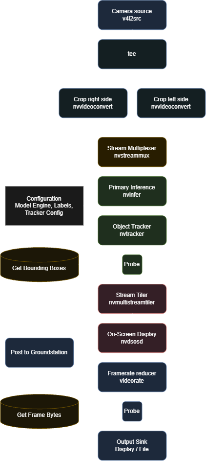

# 
 What Does Our Computer Vision Pipeline Do? 

Our computer vision pipeline is powered by a DeepStream pipeline with a YOLO26 inference model.

    

## What Is NVIDIA DeepStream?

[NVIDIA DeepStream](https://developer.nvidia.com/deepstream-sdk) is an open-source toolkit built on [Gstreamer](https://gstreamer.freedesktop.org/). Gstreamer is a popular computer vision tool because of its ease of use, modularity, and adaptability. A Gstreamer pipeline is built with a series of "plugins" that connect together. DeepStream expands on this by creating custom plugins to do gpu-accelerated tasks, like inference. Additionally, DeepStream allows for batched processing, allowing multi-source video streams to be processed efficiently.

## What Do We Do?

Our computer vision system has 2 primary tasks: find objects and locate objects. Finding the objects is done by the object_detection node, and locating the objects is done by the localization node.

Our YOLO26 model, in the nvinfer plugin, puts bounding boxes around every boat and buoy it sees. The bounding boxes are passed to nvtracker, which gives everything a unique id. These ids help us track individual objects on the water.

Our first publisher is raw bounding box data. This is received by the localization node to do stereo depth estimation and triangulation.

### Explanation of our Pipeline

Our pipeline starts with a camera, accessed by [v4l2src](https://gstreamer.freedesktop.org/documentation/video4linux2/v4l2src.html?gi-language=python). The camera we currently use is a [Zed 2i Stereo Camera](https://www.stereolabs.com/store/products/zed-2i). 

Because our camera outputs the left and right camera streams as a single side-by-side stream, we split the frame in half with [nvvideoconvert's](https://docs.nvidia.com/metropolis/deepstream/7.1/text/DS_plugin_gst-nvvideoconvert.html) src-crop function and send each to the muxer in parallel.

The next major element is [nvstreammux](https://docs.nvidia.com/metropolis/deepstream/7.1/text/DS_plugin_gst-nvstreammux2.html). Although it is called a multiplexer, it actually batches inputs together. This is the key element that allows for fast and efficient multi-stream support. If we were to add more cameras to the boat, we can simply add more inputs into nvstreammux without changing any of the downstream functionality.

Directly following the muxer are [nvinfer](https://docs.nvidia.com/metropolis/deepstream/7.1/text/DS_plugin_gst-nvinfer.html) and [nvtracker](https://docs.nvidia.com/metropolis/deepstream/7.1/text/DS_plugin_gst-nvtracker.html), the crux of our pipeline. Nvinfer is connected to our YOLO26 model that infers on every frame in a batch. To do this, the default `.pt` file has to be exported to `.engine`, which is specially designed for gpu processing. While we use YOLO, nvinfer can be used with a variety of models, if you provide a library to process it. Our model is trained to look for buoys and boats. Bounding boxes created by nvinfer are sent to nvtracker, which assigns every object a unique id. Nvtracker is able to follow objects as they move across the frame, and even if they pop in and out of frame briefly.

After nvtracker is where we have our first [probe](https://gstreamer.freedesktop.org/documentation/additional/design/probes.html?gi-language=python). Probes are the easiest way for us to access the data that is traveling through the pipeline. This probe, called `_infer_probe` in the code, copies all of the bounding box data that is seen and publishes it through ROS.

After this point we start to get into visualization. [Nvmultistreamtiler](https://docs.nvidia.com/metropolis/deepstream/7.1/text/DS_plugin_gst-nvmultistreamtiler.html) is a plugin that takes all the frames in a batch and lays them out on a grid, so you can see them all at once. You can also optionally select a specific stream to show. This plugin unbatches the inputs and only outputs a single frame. [Nvdsosd](https://docs.nvidia.com/metropolis/deepstream/7.1/text/DS_plugin_gst-nvdsosd.html) draws the bounding boxes on the frame. Previously, bounding box data was only transferred as metadata. Now, it is actually drawn on the frame. You can also use this to manually add certain elements like overlays.

After this we step down the framerate with [videorate](https://gstreamer.freedesktop.org/documentation/videorate/index.html?gi-language=python). Up until now, our pipeline has been running at a pretty smooth 30 fps. However, we also want to send some frames to the groundstation, but we don't want to use up all of our cellular bandwith, so we step the frame rate down to 5 fps which is just enough to get a good idea of what the boat is doing. We insert a probe right after to get the frame as a series of bytes in png format. Finally, the nveglglessink plugin creates a pop-up window to see the final result.

## Why Do We Use DeepStream?

The primary advantages to DeepStream and Gstreamer are performance, modularity, and future expandability.

Something like OpenCV is easy to get started with, but it very quickly starts to bog down the system. With DeepStream, we can use heavier models while still maintaining a stable 30 fps. Additionally, the modularity allows us to easily connect different plugins together to do new tasks. Having a single plugin like nvmultistreamtiler saves us a lot of effort when trying to visualize more than one stream. And finally, for future expandability, DeepStream offers so many features that we are not even using yet.

## Potential Long-Term Improvements

[SAHI](https://github.com/obss/sahi) is an inference method that divides the frame into smaller pieces. Instead of doing one pass on the entire frame, we divide it into smaller sections and infer on those instead. Our model uses a 640x640 pixel image as input, so our 1280x720 image gets downscaled and padded. The biggest advantage of SAHI is better accuracy on small objects, but it could have negative performance impacts. While there isn't a way to directly implement the SAHI library, we should be able to implement it ourselves manually.

Nvtracker has the option to connect a [re-identification model](https://docs.nvidia.com/metropolis/deepstream/7.1/text/DS_plugin_gst-nvtracker.html#setup-and-usage-of-re-id-model). While we haven't really worried about this, if an object disappears for more than about a quarter second, the tracker will give it a new id. Because of our filtering in the triangulation algorithm, this is not that much of an issue, but it does cause us to have a lot of "ghost" objects.

A feature that is not relevant right now, but could be later is secondary inference. Our nvinfer plugin is set into primary mode meaning it performs inference directly on the frame. A secondary inference would be put after the primary inference and would infer on objects already detected. For example, if we wanted to detect navigational markers and buoys to follow the channel, the primary nvinfer would look at the image and find markers and buoys. Then, the secondary nvinfer would look at the markers and buoys already found and determine if they are green or red.

## Useful Documentation Pages

- [DeepStream](https://docs.nvidia.com/metropolis/deepstream/7.1/text/DS_Overview.html) documentation
- [DeepStream Python](https://docs.nvidia.com/metropolis/deepstream/dev-guide/python-api/index.html) documentation
- List of [default Gstreamer plugins](https://gstreamer.freedesktop.org/documentation/plugins_doc.html?gi-language=python)
- Marcoslucianops' [DeepStream-Yolo](https://github.com/marcoslucianops/DeepStream-Yolo) library and documentation
- [Ultralytics YOLO26](https://docs.ultralytics.com/models/yolo26)
